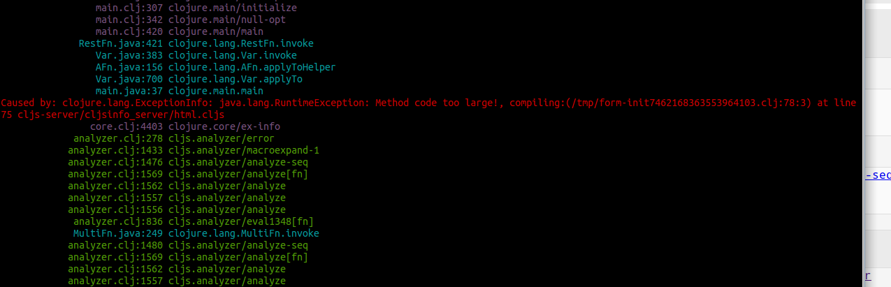

# "code too large"

Thought I would add this little lesson I learned from this project.

When I was initially starting off with the cheatsheet I used straight  HTML to
get the layout / design right before starting any abstraction. My workflow was
just copy / paste Hiccups in one large render function.

At some point I made a new section and didn't see the result in the browser after
saving the file, then checked my console and saw this:

Guess there's limit on how long a function can be in Clojure :)

Fixed it with commit 83ba391