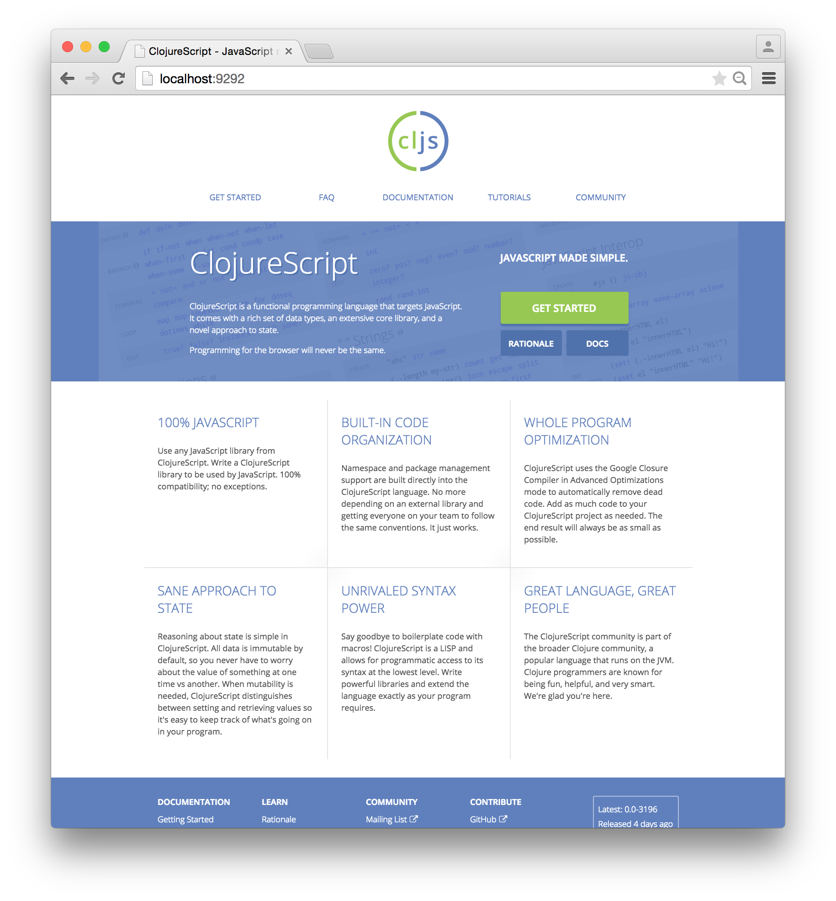
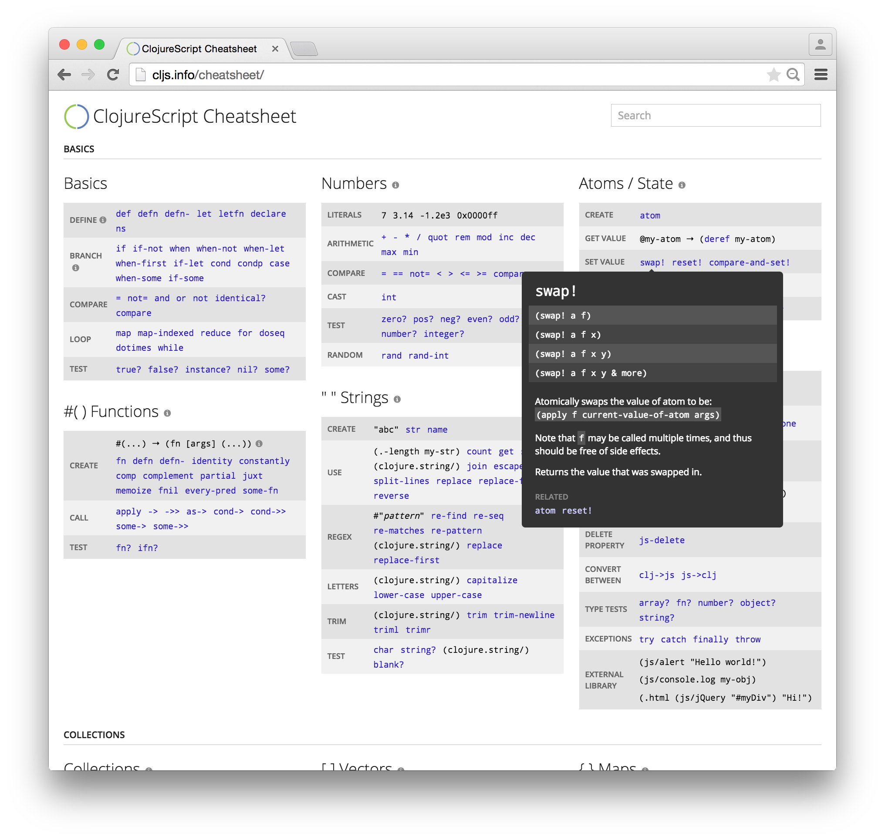

# cljs.info

An upcoming website for ClojureScript at <http://cljs.info>.

[](https://github.com/cljsinfo/cljs.info/raw/master/screenshots/homepage00.png)

## Goal

Make an awesome website for ClojureScript. Right now the project mostly consists
of a [cheatsheet](http://cljs.info/cheatsheet) (screenshot below), and the
long-term plan is to have a catchy homepage, tutorials, ClojureScript-specific
docs, etc.

[](https://github.com/cljsinfo/cljs.info/raw/master/screenshots/cheatsheet00.png)

## Development Setup

1. Install [Leiningen] and [Node.js].
1. Run from the project directory:

    ```sh
    # install node.js dependencies
    npm install

    # compile LESS file
    grunt

    # compile ClojureScript files (this may take a minute)
    lein do clean, cljsbuild once

    # copy the example config file (edit as needed)
    cp example.config.json config.json

    # start the node.js server
    node app.js
    ```

## License

All code licensed under the terms of the [MIT License].

[cheatsheet]:http://cljs.info/cheatsheet
[Leiningen]:http://leiningen.org
[Node.js]:http://nodejs.org
[MIT License]:https://github.com/oakmac/cljs.info/blob/master/LICENSE.md
